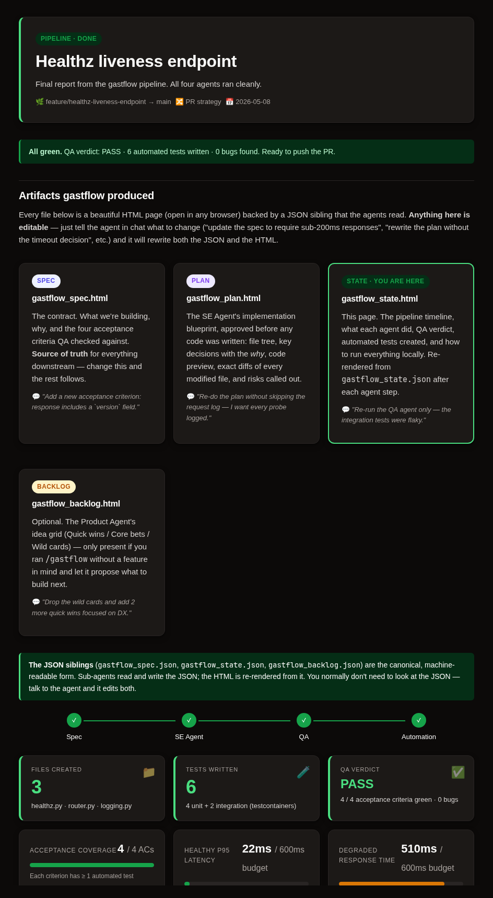
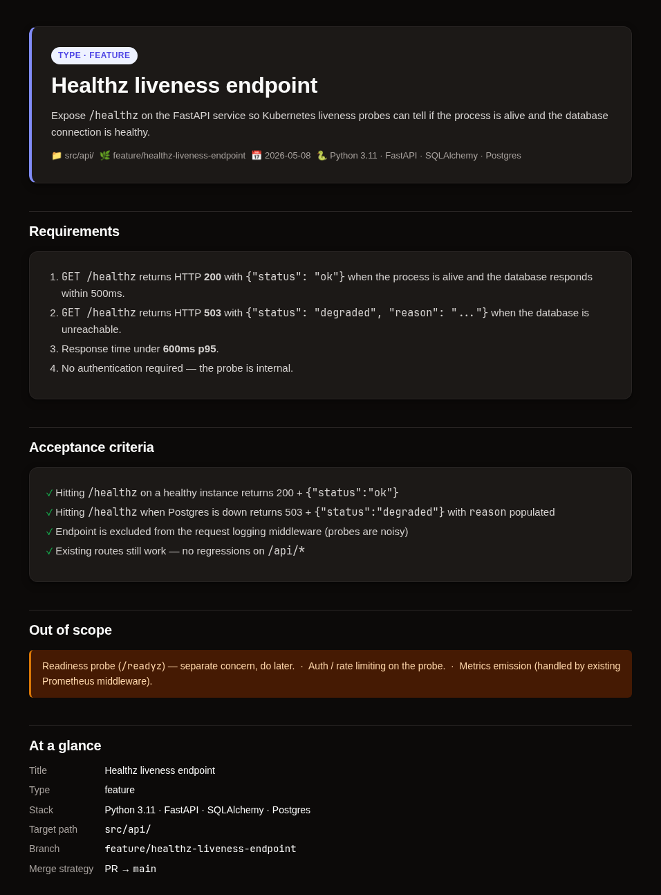
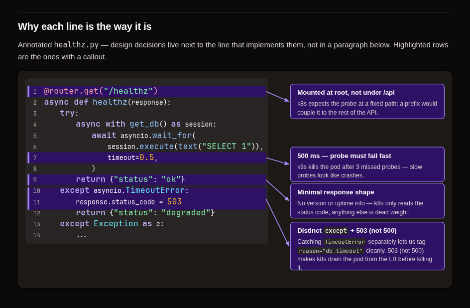

# gastflow

An agentic software development workflow for Claude Code. You describe what you want to build — gastflow clarifies, writes a spec, delegates to specialized sub-agents, and ships.

The output is **not Markdown**. Every spec, plan, and final report is a self-contained HTML page you can open in a browser, share via link, and read on your phone. Inspired by [The Unreasonable Effectiveness of HTML](https://thariqs.github.io/html-effectiveness/) by Thariq (Claude Code team).



---

## Install

One-liner (no clone needed):

```bash
curl -fsSL https://raw.githubusercontent.com/gastonmira/gastflow/main/install.sh | bash
```

Or clone:

```bash
git clone https://github.com/gastonmira/gastflow
cd gastflow && ./install.sh
```

## Usage

Open any project in Claude Code and run:

```
/gastflow
```

Don't have a feature in mind? `/gastflow` will offer to run the **Product Agent** first — it scans your project and proposes a backlog of ideas grouped into Quick wins / Core bets / Wild cards.

## How it works

```
(optional) Product Agent → gastflow_backlog.{html,json}
                                  ↓
You → /gastflow (Orchestrator)
         ↓
   Clarify requirements (1-2 questions at a time)
         ↓
   Write gastflow_spec.{html,json}   ← you approve before anything else moves
         ↓
   SE Agent (feature) or Bug Fix Agent
         ↓ shows you gastflow_plan.html with file tree, decisions,
           diffs, and (if you ask) an annotated-code diagram
         ↓ you approve → it implements
         ↓
   QA Agent ──────── Automation Agent
   (tests it)        (writes regression / coverage tests)
         ↓
   Final report at gastflow_state.html — timeline, files, verdict,
   how to run it, and links to every other artifact
```

Every step is **conversational**. You can rewrite the spec, push back on the plan, or ask the agent to redo the diagram in a different style — it edits both the JSON (canonical) and the HTML (the rendered version) for you.

## Outputs are HTML, not Markdown

Each artifact is a **pair**:

| Artifact | What it is | Read by |
|---|---|---|
| `gastflow_spec.html`    + `.json` | The contract — title, requirements, acceptance criteria | You (HTML) · sub-agents (JSON) |
| `gastflow_plan.html`             | The implementation blueprint before any code is written — file tree, decisions with the *why*, diffs of every modified file, optional diagram | You |
| `gastflow_state.html`   + `.json` | The pipeline report — timeline, stat cards, files, QA verdict, automated test list, run commands | You (HTML) · sub-agents (JSON) |
| `gastflow_backlog.html` + `.json` | Optional. Product backlog with ideas as comparable cards | You (HTML) · Orchestrator (JSON) |

`.gastflow/memory.md` stays Markdown — it's agent-only context, not a deliverable.



### Why HTML over Markdown

We had specs in Markdown for a while. Nobody read them past the first 100 lines. Plans were skimmed. Reports went straight to the trash. The format was the bottleneck — not the content.

HTML fixes four specific things Markdown can't:

- **Information density.** A spec that needs a comparison table, a diff, a sequence diagram, a code snippet with syntax colors, and a status badge — HTML does all of that natively in one page. Markdown either falls back to ASCII art or sends you to four separate tabs.
- **Visual clarity at scale.** Past ~100 lines a Markdown file becomes a wall. An HTML page with a hero, sections, cards, and a sticky pipeline timeline stays scannable at any length. Specs you'd skim turn into pages you'd actually read.
- **Sharing.** Drop `gastflow_state.html` in S3, drop the link in Slack — it opens in the reviewer's browser. No "install a Markdown viewer" step. Your colleague reads it on their phone in dark mode without asking how.
- **The two-way loop.** Markdown's classic advantage was "easy to hand-edit." gastflow doesn't expect you to hand-edit anything — you talk to the agent and it rewrites both the JSON and the HTML. So Markdown's edit-friendliness was paying for itself with worse render quality, for nothing.

The full reasoning (and the inspiration for adopting HTML across the Claude Code team's workflows) is in Thariq's article: [The Unreasonable Effectiveness of HTML](https://thariqs.github.io/html-effectiveness/).

What we kept in Markdown: `.gastflow/memory.md`. It's read by the Orchestrator at session start and never shown to the user — pure agent context, where Markdown's parse-cheap-and-tokens-light beats HTML's render quality.

### Diagrams (opt-in)

Sub-agents can include diagrams in any artifact, but **always ask first**. Five canonical patterns:

- `linear-flow` — straight A → B → C; one-way pipeline
- `sequence` — actors as columns with lifelines; when timing matters
- `decision-tree` — vertical flow with diamond branches; for real forks (timeout vs ok, cache hit vs miss)
- `arch-stack` — layered architecture; "where does this fit in the system"
- `annotated-code` — code panel + callouts pinned to specific lines; for explaining the *why* of each line in a fix or PR

The most distinctive of the five is `annotated-code` — design intent lives next to the line that implements it, not in a paragraph below:



## What each agent does

| Agent | Job | Outputs |
|---|---|---|
| **Product Agent** | Scans the project, proposes an 8-12 idea backlog | `gastflow_backlog.{html,json}` |
| **Orchestrator** | Clarifies requirements, writes the spec, delegates, presents the final report | `gastflow_spec.{html,json}`, `gastflow_state.{html,json}` |
| **SE Agent** | Implements features | Code + `gastflow_plan.html` + updates state |
| **Bug Fix Agent** | Investigates root cause, applies a minimal fix | Code change + `gastflow_plan.html` + updates state |
| **QA Agent** | Tests the implementation against acceptance criteria | Updates state with verdict + bug list |
| **Automation Agent** | Writes automated tests (regression test for bugfixes) | Test files + updates state |

Sub-agents read each other's outputs from the JSON sidecars; they never have to parse HTML. Re-render of the HTML happens after each step so the page you see is always current.

## Editing artifacts

Every artifact is editable through the chat. Examples you can paste:

- *"Add an acceptance criterion: response includes a `version` field."*
- *"Re-do the plan without skipping the request log — I want every probe logged."*
- *"Re-run the QA agent only — the integration tests were flaky."*
- *"Drop the wild cards in the backlog and add 2 more quick wins focused on DX."*

The agent rewrites both the `.json` and the `.html` — you don't touch the JSON manually.

## Requirements

- [Claude Code](https://claude.ai/code) installed
- Optional: [Context7](https://github.com/upstash/context7) MCP for up-to-date library docs (`claude mcp add context7 -- npx -y @upstash/context7-mcp`)
- Optional: Playwright for UI testing in QA (`npm install -D @playwright/test`)

## Uninstall

```bash
rm -rf ~/.claude/skills/gastflow ~/.claude/skills/gastflow-product ~/.claude/skills/gastflow-se ~/.claude/skills/gastflow-bugfix ~/.claude/skills/gastflow-qa ~/.claude/skills/gastflow-automation
```

## Contributing

The product is the set of skill files in `skills/`. The orchestration logic lives in `skills/gastflow.md`; each sub-agent has its own file. The shared HTML design system is `skills/gastflow-html-template.html` — change CSS there, not in each skill. PRs welcome.

## License

MIT
